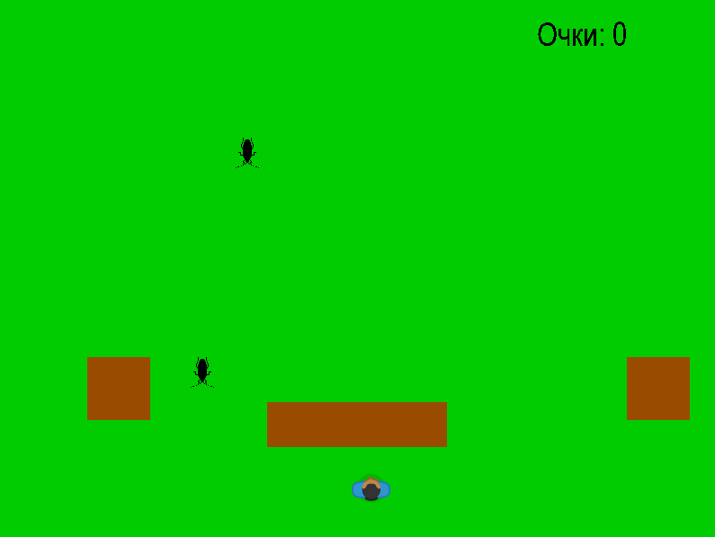

# Roach Shooter Game

**2D аркадная игра на PyGame с системой уровней и прогрессирующей сложностью**

## Описание проекта
Аркадная игра, в которой игрок управляет персонажем и должен отстреливать падающих тараканов. Игра содержит систему уровней с увеличивающейся сложностью, препятствиями и системой очков. 

## Технологический стек
- Язык: Python 3.x
- Библиотеки: PyGame, JSON
- Архитектура: Объектно-ориентированное программирование

## Игровой процесс

### Основная механика
- Управление персонажем: WASD для движения
- Стрельба: Space для выстрелов
- Цель: Уничтожить всех тараканов на уровне
- Прогрессия: 3 уровня с увеличивающейся сложностью

## Фрагмент игры

